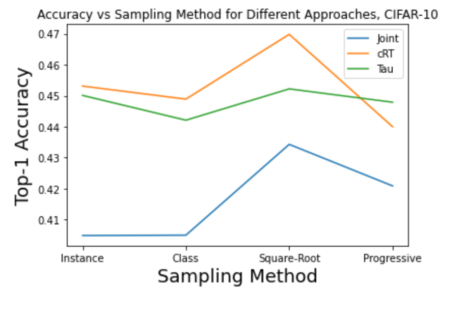

# Open World Perception - Group 2

This weeks papers are about Open World Perception, particularly:

* [Towards Open Set Deep Networks, Bendale, Boult; 2015](https://arxiv.org/abs/1511.06233
* [Large-Scale Long-Tailed Recognition in an Open World, Liu, Miao, Zhan, Wang, Gong, Yu; 2019](https://arxiv.org/abs/1904.05160)
* [Class-Balanced Loss Based on Effective Number of Samples, Cui, Jia, Lin, Song, Belongie; 2019](https://arxiv.org/abs/1901.05555)
* [Decoupling Representation and Classifier for Long-Tailed Recognition, Kang, Xie, Rohrbach, Yan, Gordo, Feng, Kalantidis; 2019](https://arxiv.org/abs/1910.09217)
* [Overcoming Classifier Imbalance for Long-tail Object Detection with Balanced Group Softmax, Li, Wang, Kang, Tang, Wang, Li, Feng; 2020](https://arxiv.org/abs/2006.10408)

## Decoupling Representation and Classifier for Long-Tailed Recognition

### **Code Structure**

The code needed to replicate these experiments are found in ``./notebooks/DecouplingRepresentationAndClassifer/*``. There is a seperate notebook for each of the datasets that the experiments were tested on. The code for loading the datasets, defining the model architectures, and the training code is found in these notebooks. 

### **Command to Run the Code**

The code for the experiemnts are in a ``.ipynb notebook`` that was created and run on Colab. It includes the necessary commands to run directly on Colab. If trying to replicate these experiments, I recommend directly uploading the notebooks to Colab and running it there to avoid dealing with packages and dependencies. 

### **Datasets**

We ran experiments on the three datasets:

* **CIFAR-10**  32x32, 10 Classes, 5000 Training Images, 1000 Test Images per Class  https://www.cs.toronto.edu/~kriz/cifar.html
* **CIFAR-100**  32x32, 100 Classes, 500 Training Images, 100 Test Images per Class https://www.cs.toronto.edu/~kriz/cifar.html
* **TinyImageNet**  64x64, 200 Classes, 500 Training, 50 Test Images per Class http://cs231n.stanford.edu/reports/2015/pdfs/yle_project.pdf

Normally, the training data for these datasets is balanced and has equal number of images per class. However, the paper for these experiments deals with long-tailed data distributions. Therefore, we took these three datasets and created long-tailed versions of these datasets that we will refer to as Long-Tailed CIFAR-10, Long-Tailed CIFAR-100, and Long-Tailed Tiny ImageNet. We created these new training datasets by sampling fewer and fewer images for successive class labels. For instance, the data frequency distribution for our Long-Tailed CIFAR-10 dataset looks like this:

  

### **Task**

Evaluating Joint Training vs Decoupling Learning Representation and Classifier Methods for Long-tailed Recognition

### **Model Architecture**

We use the pytorch implementation of the [ResNeXt-50 architecture](https://pytorch.org/hub/pytorch_vision_resnext/) for the backbone network that learns the feature representations of the images. For the Joint approach, another linear layer is appended to the end of the backbone network such that for an image X, I obtain a linear classifier g(z) = W^T + b, where W denotes the linear layer weights, b is the bias, and z is the learned feature representation of the image X found by the ResNeXt-50 model. In this method, the gradient is passed through the classifier and the representation learning network and they are jointly trained. 

For the decoupled approach, we trained the backbone ResNeXt-50 model for some number of epochs and then discard its classifier and only keep the components of the network that are important for feature representation. Then, we load the pre-trained backbone network and initialize a new linear layer that is fine tuned for a fewer number of epochs while keeping the backbone network fixed. The linear classifier layer is trained with gradient updates and the goal is to better define decision boundaries.

### **Conducted Experiments**

The paper explains two different approaches:
* Joint - The Backbone Feature Representation Network and the Classifer are Trained Together
* Decoupled - The Backbone Feature Representation Network is fixed while the Classifier is Fine-tuned and re-balanced

In addition, we test out the performance of the two approaches when using different sampling strategies:
* Instance-balanced - each image has an equal chance of being selected
* Class-balanced - each class is equally likely to be selected, and each image in the class is equally likely to be selected
* Square Root - Variant of instance-balanced
* Progressively-balanced - Combination of both Instance-balanced and Class-balanced

With the decoupled approach, we tried 2 different types of classifiers:
* Classifier Re-Training (cRT) - Standard approach of reinitializing classifier and fine-tuning it with fixed backbone network
* Tau-normalized Classifier (Tau-Norm) - approach where weights of linear layer are adjusted through a tau-normalization procedure where tau is a hyperaparameter

We conduct experiments on the different sampling strategies and how they affect performance for both the Joint and Decoupled Approaches.

### **Results**

**Long-tailed CIFAR-10**

|             | Joint         | cRT          | Tau-Norm      | 
| ----------- | ------------- | ------------ | ------------- |
| Instance-balanced   | 0.4049           | 0.4531          | 0.4501            | 
| Class-balanced      | 0.405        | 0.4489           | 0.4421            |
| Square Root         | 0.4343  | 0.4698  | 0.4522   |
| Progressively-balanced   | 0.4209 | 0.4400 | 0.4479   |

  

The Joint approach was trained for 30 epochs, learning rate = 1e-3, and a batch size = 128, using Cross Entropy Loss and Adam Optimizer. For the Decoupled methods, the backbone network was trained for 30 epochs, and the classifiers were re-trained for 10 epochs with the same batch size, learning rate, and other training/optimization parameters as the Joint approach. The Tau hyperparameter was set to 0.2.

The Decoupled method outperforms the Joint training approach on the Long-tailed Variant of CIFAR-10 by about 5%, especially with the cRT method. With the Joint training approach, the sampling methods were important to obtain good results as Square-root sampling led to an approximate 3% performance gain over instance-balanced sampling. In our experiments with CIFAR-10, the cRT classifier outperformed the Tau-Norm classifier. Unlike the results in the paper, for this dataset, we found that Square-root sampling outperformed instance-balanced sampling for both cRT and Tau-Norm classifiers. Overall, decoupling the representation network and the classifier led to a significant performance gain for this particular dataset.

**Long-tailedCIFAR-100**

|             | Joint         | cRT          | Tau-Norm      | 
| ----------- | ------------- | ------------ | ------------- |
| Instance-balanced   | 0.2690          | 0.3245          | 0.3224            | 
| Class-balanced      | 0.2708        | 0.3017          | 0.3062            |
| Square Root         | 0.3089 | 0.3204  | 0.3165   |
| Progressively-balanced   | 0.2955 | 0.3150 | 0.3107   |

  

The Joint approach was trained for 30 epochs, learning rate = 1e-3, and a batch size = 128, using Cross Entropy Loss and Adam Optimizer. For the Decoupled methods, the backbone network was trained for 30 epochs, and the classifiers were re-trained for 10 epochs with the same batch size, learning rate, and other training/optimization parameters as the Joint approach. The Tau hyperparameter was set to 0.5.

Like the previous dataset, we observe a significant performance gain when using the paper's suggested decoupling approach. Specifically, we see a about a 6% top-1 accuracy gain over the Joint approach. With the Joint-approach, square root sampling was the best option. However, with the decoupled classifiers cRT and Tau-Norm, we found that the instance-balanced sampling methods were more successful compared to the other 3 sampling strategies. This aligns with the paper's argument that with the decoupling approach, the model learns to generalize better, which makes the usage non-instance-balanced sampling obsolete. All in all, we were able to get results for this dataset that concur with the points made in the paper. 

**Long-Tailed Tiny-ImageNet**

|             | Joint         | cRT          | Tau-Norm      | 
| ----------- | ------------- | ------------ | ------------- |
| Instance-balanced   | 0.1875          | 0.2918          | 0.2816            | 
| Class-balanced      | 0.1799        | 0.277          | 0.2852            |
| Square Root         | 0.1904 | 0.2861  | 0.2746   |
| Progressively-balanced   | 0.1844 | 0.2746 | 0.2722   |

  

The Joint approach was trained for 5 epochs, learning rate = 1e-3, and a batch size = 128, using Cross Entropy Loss and Adam Optimizer. For the Decoupled methods, the backbone network was trained for 5 epochs, and the classifiers were re-trained for 2 epochs with the same batch size, learning rate, and other training/optimization parameters as the Joint approach. The Tau hyperparameter was set to 0.7.

Similar to the other two datasets, the decoupled methods outperform the joint training approach on the long-tailed data. cRT instance-balanced classifier was able to get a top-1 accuracy that is approximately 10% more than the best Jointly trained classifier. In addition, the instance-balanced methods performed relatively well and were able to sufficiently generalize. The cRT and Tau-Norm classifiers demonstrated similar top-1 accuracies. Overall, we were able to get a significant performance gain with the the decoupled approach on this dataset when compared to the joint approach.

**Sampling Strategies Ablation**

We typically found that the Square-root sampling approach was most beneficial for the Joint method, while, the samping method did not play that large of a factor with cRT and Tau-norm classifiers. When training jointly, other sampling methods outperformed instance-balanced sampling. However, decoupling the representation learning and classifier led to instance-balanced sampling typically leading to the best results.

### **Conclusion**

All in all, the decoupled methods led to significant performance gains over the jointly trained approach. This is evident for all three datasets that we performed experiments on. We found tha the sampling method used is important when training jointly, while it is not so important when using the decoupled methods as the instance-balanced sampling led to competitive if not better results than the latter approaches. We found that the decoupled approach led to better performance on long-tailed image recognition task. The decoupled approach allowed us to re-balance the classifiers while keeping the backbone represenation network fixed. By using relatively simple methods, we were able to see that the decoupled approach is a legitimate option in improving performance of models on long-tailed datasets.

# TODO: Datasets

# TODO: Towards Open Set Deep Networks

# TODO: Large-Scale Long-Tailed Recognition in an Open World

# TODO:	Class-Balanced Loss Based on Effective Number of Samples

# TODO:	Decoupling Representation and Classifier for Long-Tailed Recognition

# TODO: Overcoming Classifier Imbalance for Long-tail Object Detection with Balanced Group Softmax

## Dataset

The authors of the paper are working with the long-tail [LVIS dataset](https://www.lvisdataset.org/) and their long-tail-sampled version of COCO [COCO-LT](https://arxiv.org/pdf/2007.11978.pdf). Both of these datasets are very large and take days to train on the hardware we had available (GTX 1060 6GB). The point of the paper is to work with long-tailed datasets, since the distribution of object categories in reality is typically imbalanced. The authors state in the paper that PASCAL VOC is manually balanced and thereby not suitable for this task. Since PASCAL VOC 2007 is a lot smaller than COCO, we decided to write a script to sample our own long-tailed version of VOC2007, VOC2007-LT.

TODO: image of class distribution

TODO: experiments

# TODO: Conclusion?

