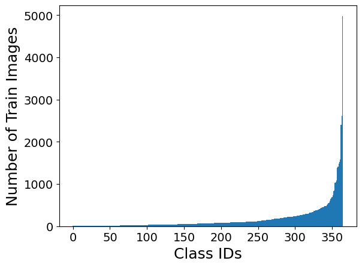
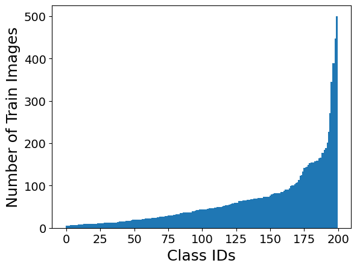

# Large-Scale Long-Tailed Recognition in an Open World

## Experimental Setup
Code for the OLTR experiments are directly taken from the authors original implementation ([Github Source](https://github.com/zhmiao/OpenLongTailRecognition-OLTR)). All experiments are done on single V100 GPU. We experiment OLTR on following 2 datasets:
* **Places_LT**: Long Tailed version of [Places365](http://places2.csail.mit.edu/download.html) dataset prepared by the authors for experiments in the paper
* **Tiny-ImageNet_LT**: Long Tailed version of [Tiny-ImageNet-200](https://www.kaggle.com/c/tiny-imagenet) dataset prepared by us by sampling a subset of the dataset following a Pareto distribution (alpha=6)

Places_LT | Tiny-ImageNet_LT
:---:|:---:
|
