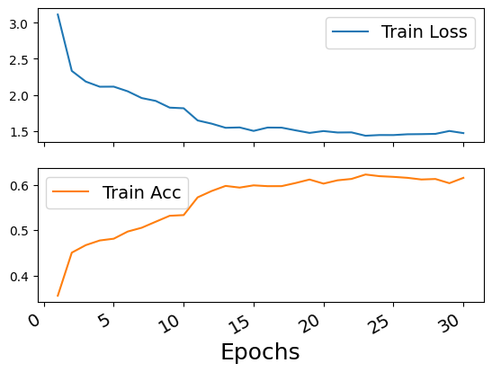
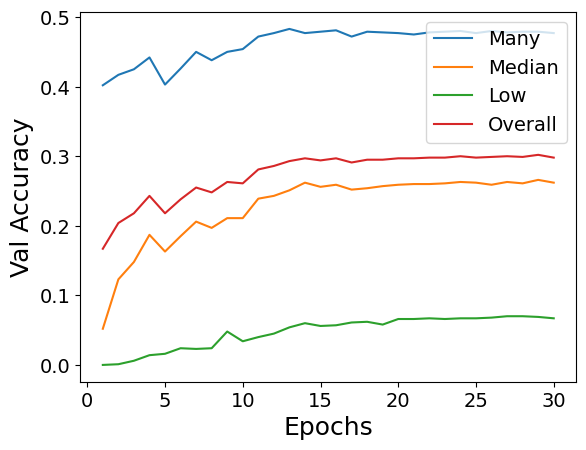
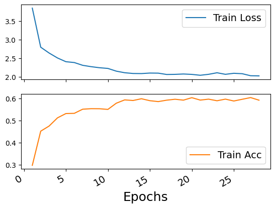
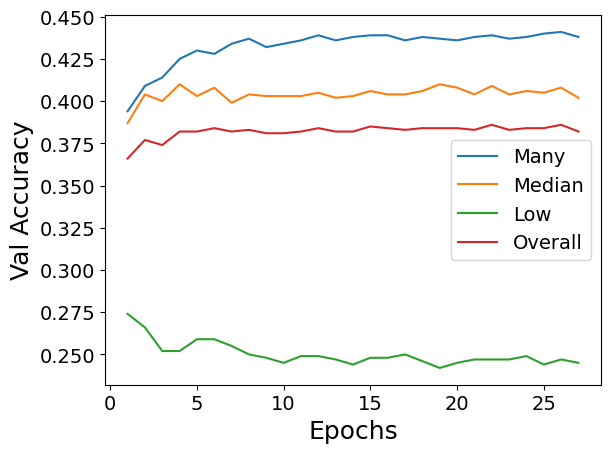
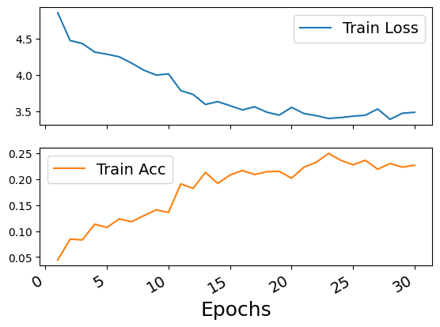
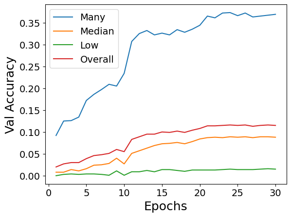
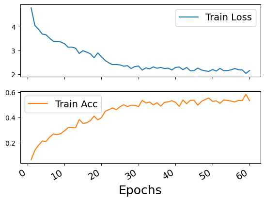
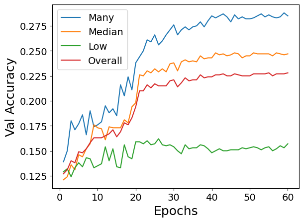

# Large-Scale Long-Tailed Recognition in an Open World

## Experimental Setup
Code for the OLTR experiments are directly taken from the authors original implementation ([Github Source](https://github.com/zhmiao/OpenLongTailRecognition-OLTR)). All experiments are done on single V100 GPU. We experiment OLTR on following 2 datasets:
* **Places_LT**: Long Tailed version of [Places365](http://places2.csail.mit.edu/download.html) dataset prepared by the authors for experiments in the paper
* **Tiny-ImageNet_LT**: Long Tailed version of [Tiny-ImageNet-200](https://www.kaggle.com/c/tiny-imagenet) dataset prepared by us by sampling a subset of the dataset following a Pareto distribution (alpha=6)

Places_LT | Tiny-ImageNet_LT
:---:|:---:
|

## Results
### Places_LT
We can see that many-shot labels heavily contribute to the overall validation accuracy in stage 1 training. In stage 2, we can observe that while many-shot labels are still the highest contributor to the overall validation accuracy, median and low-shot labels start performing comparable.

 

Fig.1 Stage 1 training statistics

 

Fig.2 Stage 2 training statistics

### Tiny-ImageNet_LT
We see a similar trend in the overall validation accuracy's distribution over many, median and low shot label regimes across stage 1 and stage 2

 

Fig.3 Stage 1 training statistics

 

Fig.4 Stage 2 training statistics

### Test Results (*Top 1 Accuracy*)

Dataset | Overall | Many-shot | Median-shot | Low-shot | Open
:---:|:---:|:---:|:---:|:---:|:---:
Tiny-ImageNet_LT | 0.228 | 0.285 | 0.247 | 0.157 | -
Places_LT | 0.389 | 0.435 | 0.403 | 0.279 | -
Places_LT open | 0.385 | 0.433 | 0.399 | 0.274 | 0.082
